# Validation and serialization

siderite validation is modelled on Pydantic v2, but built from Rust traits and derives rather than runtime type inspection.

```rust
use siderite::prelude::*;

#[derive(Deserialize, Validate, Schema)]
#[serde(rename_all = "camelCase")]
#[model_config(extra = "forbid", str_strip_whitespace)]
struct CreateUser {
    #[field(min_length = 2, max_length = 50)]
    user_name: String,
    #[field(email)]
    email: String,
    #[field(ge = 13)]
    age: Option<u8>,
}
```

Using `Json<CreateUser>` as a handler argument runs the whole pipeline. When the input is invalid, the handler is not called. The client gets a `422` problem document that lists **every** error, not just the first:

```json
{
  "type": "about:blank",
  "title": "Unprocessable Entity",
  "status": 422,
  "detail": "The request could not be processed; see `errors` for details.",
  "errors": [
    {"location": ["body", "userName"], "code": "too_short", "message": "should have at least 2 items/characters"},
    {"location": ["body", "email"], "code": "invalid_email", "message": "invalid email address"},
    {"location": ["body", "role"], "code": "extra_forbidden", "message": "extra inputs are not permitted"}
  ]
}
```

## The pipeline

```mermaid
flowchart LR
    raw[raw JSON / query / form] --> bm[model before-validators]
    bm --> walk[field walk: aliases, missing, extra]
    walk --> bf[field before-validators]
    bf --> leaf[type-driven prepare: coercion + type checks]
    leaf --> cons[field constraints on raw value]
    cons --> serde[Serde deserialize]
    serde --> after[field after-validators, then model after-validators]
    after --> handler[handler]
```



1. **`Validate::prepare` runs on the raw value, and it is type driven.** Each type checks, and in lax mode coerces, its own part of the input:
   * integers accept `"42"` and `3.0`;
   * `bool` accepts `"yes"`, `"on"` and `1`;
   * strings apply the model's trim and case settings;
   * constrained types check their bounds.

   Because each type does this itself, coercion also works through newtypes and aliases. All errors are collected before anything is deserialized.
2. **Serde deserializes** the prepared value. A property test checks that when `prepare` accepts an input, Serde accepts it too.
3. **`Validate::validate` runs on the typed value.** Nested models, after-validators and model validators run here.

Query strings, forms and path segments count as *text input*: string-to-number coercion is always allowed for them, even in strict mode. A key that is repeated in a query string fills a `Vec` field.

## Model configuration: `#[model_config(...)]`

| Key | Meaning |
|---|---|
| `strict` | No lax coercion: `"1"` is not an integer, and `1` is not a bool. |
| `extra = "ignore" \| "forbid" \| "allow"` | What happens to unknown keys. Rust structs cannot store extra keys, so `allow` accepts them and then drops them. `#[serde(deny_unknown_fields)]` implies `forbid`, and `forbid` sets `additionalProperties: false` in the schema. |
| `populate_by_name` | For fields that have an alias, the Rust field name is also accepted as an input key. |
| `str_strip_whitespace`, `str_to_lower`, `str_to_upper` | Transforms applied to every string field of this model. |
| `hooks` | Required on **generic** models that have `#[model_hooks]`; see below. |

Settings apply only to the model they are declared on. Nested models use their own settings, as in Pydantic.

## Field configuration: `#[field(...)]`

The same attribute is read by both `#[derive(Validate)]` and `#[derive(Schema)]`, so the constraints you validate are the constraints that get documented.

| Key | Validation | Schema |
|---|---|---|
| `min_length`, `max_length` | Characters in a string, or items in a list or map | `minLength`/`maxLength`, or `minItems`/`maxItems` |
| `pattern = "regex"` | Whole-value match. The regex is checked when the macro expands. | `pattern` |
| `email` | Email format check | `format: email` |
| `gt`, `ge`, `lt`, `le` | Numeric bounds, compared exactly for integers | `exclusiveMinimum`, `minimum`, `exclusiveMaximum`, `maximum` |
| `multiple_of` | Divisibility | `multipleOf` |
| `validation_alias = "x"` | Extra accepted input key | — |
| `default = expr`, `default_factory = path` | Field becomes optional; Serde must also default it | Field left out of `required` |
| `strict` | Strict mode for this field only | — |
| `exclude` | Left out of `dump` output | — |
| `validator = path` | Reusable after-validator, `fn(&T) -> Result<(), FieldError>` | — |
| `title`, `description`, `examples(...)` | — | Annotations |

Key names always come from Serde (`rename`, `rename_all`). Error locations use the key the client actually sent, which may be an alias.

## Validators, computed fields and serializers

```rust
#[model_hooks]
impl CreateUser {
    #[field_validator("user_name", mode = "after")]
    fn not_reserved(value: &str) -> Result<(), FieldError> {
        if value == "admin" { Err(FieldError::new("reserved", "name is reserved")) } else { Ok(()) }
    }

    #[model_validator(mode = "after")]
    fn adult_email(&self) -> Result<(), FieldError> { Ok(()) }

    #[computed_field]
    fn display_name(&self) -> String { format!("@{}", self.user_name) }
}
```

Hooks always run in this order:

1. Model before-validators.
2. For each field, in declaration order: its before-validators, then its type's `prepare`, then its constraints.
3. Serde deserialization.
4. Field after-validators, in declaration order.
5. Model after-validators.

The derives find `#[model_hooks]` without being told, as long as the model type is concrete. A **generic** model such as `Page<T>` with hooks must declare `#[model_config(hooks)]`; without it, hooks on a generic model are not called. Field validators and serializers take `(value: &FieldTy)`. A reusable `#[field(validator = path)]` runs right after the field's own checks, before the `#[model_hooks]` validators. `#[field_validator]` requires `#[derive(Validate)]`.

## Serialization: `Dump`

`Json<T>` responses are serialized through `Dump`, not directly with Serde:

* `#[derive(Schema)]` implements `Dump` for any type that also derives `Serialize`. The impl is emitted under a trait bound, so input-only types still compile. `#[schema(no_dump)]` opts out explicitly.
* Computed fields, field serializers and model serializers are included, including those of nested models inside `Vec`, `Option` or maps.
* Use `JsonDump(value, DumpOptions::new().exclude_none())` to control the output per response. The available options are `exclude_none`, `exclude_defaults`, `include(FieldSet)` and `exclude(FieldSet)`.
* A hand-written type opts in with `impl Dump for T {}`, which uses plain Serde output.

Computed fields appear in the OpenAPI schema as `readOnly` properties.

Ordinary derived models and containers serialize response JSON directly,
without allocating an intermediate JSON tree. The encoded body remains
buffered until serialization succeeds. Hooks and explicit options
retain the value-based path. Existing custom `Dump::dump` implementations
remain authoritative through the default `Dump::serialize_dump` fallback.
The borrowed `validation::dump::DumpSerialize(&value, &options)` adapter
exposes this behavior to Serde consumers. An override of `serialize_dump`
must preserve the output and failure semantics of `dump`.

## Constrained types

| Type | Accepts |
|---|---|
| `ConstrainedString<MIN, MAX>` | A string with MIN..=MAX characters |
| `Email` | A string in email format |
| `SecretString` | A string that is redacted in `Debug`, `Display` and serialized output |
| `BoundedI64<MIN, MAX>` | An integer in MIN..=MAX |
| `PositiveInt` | An integer > 0 |

| `Url`, `HttpUrl` | Any URL the `url` crate parses; `HttpUrl` only `http`/`https` |
| `IpAddress`, `Ipv4Address`, `Ipv6Address` | IP address strings |
| `Uuid` | Hyphenated or simple UUID, any version |
| `Decimal<MAX_DIGITS, DECIMAL_PLACES>` | Exact decimals. Strict mode accepts only strings. Enforces Pydantic's total-digit, decimal-place and whole-digit limits. |
| `BoundedFloat<B: FloatBounds>` | Finite floats within bounds (`UnitInterval`, `NonNegative`, `Positive`, or your own) |
| `NonNegativeInt`, `NegativeInt` | Integers >= 0 and < 0 |
| `ConstrainedVec<T, MIN, MAX>` | A list with MIN..=MAX items |

`#[field(max_digits, decimal_places)]` on a plain field only documents the limits (as `x-` schema extensions). Use the `Decimal` type to enforce them.

## Hand-written implementations

`impl Validate for T {}` opts a type in without any checks. For text input such as query strings and forms, implement `prepare` as well. Without it, values are not coerced, so `?flag=true` remains a string. `siderite::validation::model::{prepare_object, FieldSpec, check}` provide the same building blocks the derive uses.

## Deferred

* `exclude_unset`: this needs to know which fields were explicitly set, which Serde does not record.
* `wrap` and `plain` validator modes.
* MessagePack output (spec §19).
* Different validation and serialization aliases on the same field. Each type has a single schema, so the derive rejects this combination.
